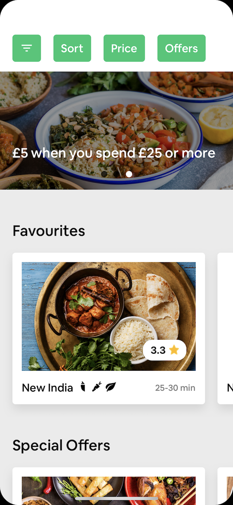
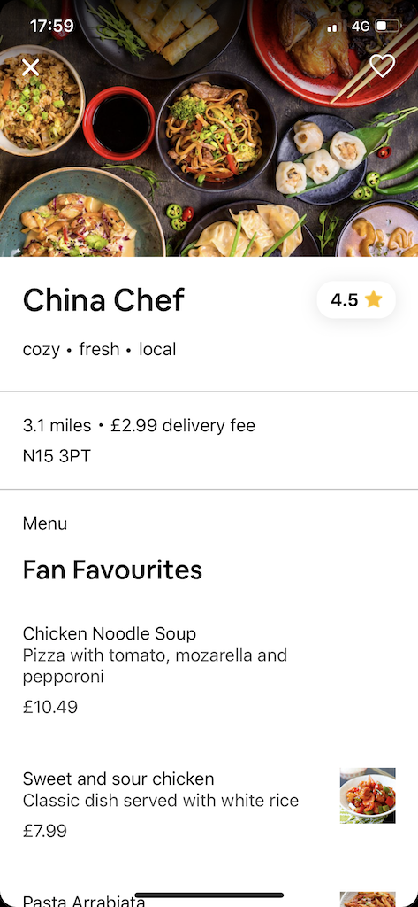
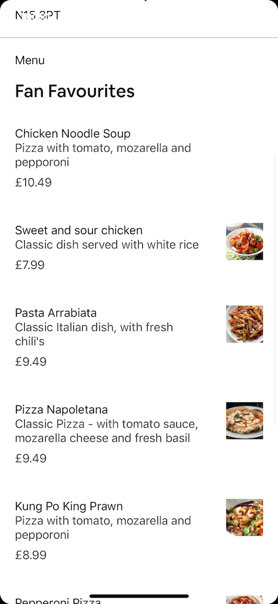

# UberEatsClone
An Uber Eats clone made with React Native, Expo & Typescript, leveraging `react-native-reanimated` &amp; `react-native-gesture-handler` for user interactions

This project was done primarily as a way for me to dive into the world of native mobile animations and gesture-based interactions. I wanted to create something like Uber Eats, but with an Airbnb-like user experience in terms of swiping gestures, etc. I'd previously found the 'out-of-the-box' `Animated` API for RN to be a bit clunky from a DX perspective, and was curious about alternative libraries. Turns out the combination of RN reanimated + gesture-handler is quite powerful, although reanimated has something of an esoteric DSL that took a while to get accustomed to. This looks to have been addressed in v2 of the library - excited to try that out in a future project!

  <h1>Demo</h1>
  
  
   
  
  <h1>Screenshots</h1>
  
  
  

